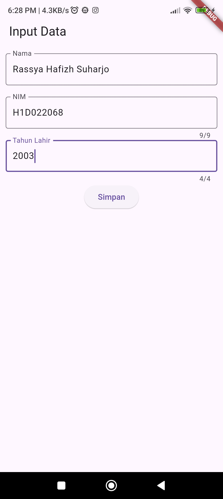
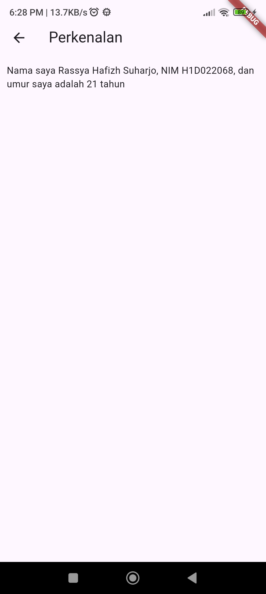

# Tugas Pertemuan 2

Nama        : Rassya Hafizh Suharjo

NIM         : H1D022068

Shift Baru  : A

## Proses Passing Data

1. Class main mengarahkan aplikasi ke home, yaitu Class FormData
2. Di dalam FormData terdapat 3 'TextEditingController()' untuk mengambil input, yaitu '_textboxNama()','_textboxNIM(), dan _textboxTahun(). Ketiganya menggunakan widget 'TextField' untuk menerima inputan user. Terdapat juga sebuah widget 'ElevatedButton' bernama '_tombolSimpan()' yang ketika ditekan akan mengambil text dari inputan pada ketiga 'TextEditingController'.
3. Setelah user mengisi data pada TextField dan menekan '_tombolSimpan()', data dari 'TextEditingController' diambil dan diubah menjadi variabel yang sesuai, misal String untuk nama dan integer untuk tahun.
4. Kemudian nama, NIM, dan tahun dimasukkan ke constructor 'TampilData' untuk diinisialisasi pada class 'TampilData' menggunakan 'Navigator.push'.
5. Setelah nilai nama, NIM, dan tahun dinisialisasi pada Class TampilData, nilai umur dicari dengan 'DateTime.now().year - tahun'.
6. Nilai nama, NIM, dan umur yang ada kemudian ditampilkan. Proses akan terulang jika user menekan tombol panah kiri pada pojok kanan.

## Screenshot
Contoh :

